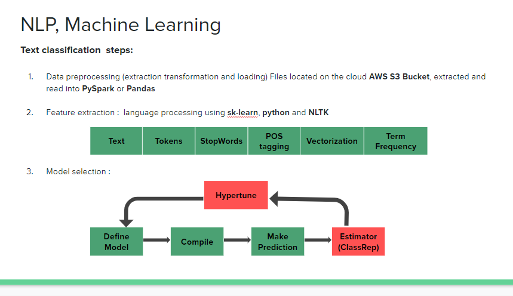

# Machine Learning, Natural_Language_Procesing

This project is focused on text classification which is one of the applications of supervised ML. Our aim was to use Natural Language Processing (NLP) along with other Machine Learning (ML) approaches to differentiate fraudulent job postings from real ones. We used a dataset of real and fake job postings from Kaggle [Kaggle](https://www.kaggle.com/shivamb/real-or-fake-fake-jobposting-prediction/version/1) with textual and non textual information. 

We created a website to display some features of the different machine learning models we used.

## PROBLEM: 
Given the current job market environment, it is important to spot fake job posts. we wanted to create a model that was able to predict which job description was real or fraudulent from the > 17K posts and identify insights from this particular data set. 
### Requirements 

The main requirements for NLP are listed below:

- Tensorflow 
- nltk
- Python 3.6
- Numpy
- Scikit-Learn
- Matplotlib
- Pandas
- PySpark
- Jupyter
- CoLab
- Amazon Web Services (S3)

Web Development:
- JavaScript 
- HTML
- CSS

# ML, NLP
## 1 Data Pre-process
Dataset is freele available at Kaggle [Kaggle](https://www.kaggle.com/shivamb/real-or-fake-fake-jobposting-prediction/version/1). Data was loaded Jupyter or CoLab and was cleaned. The data was uploaded to S3 bucket.
## 2 Feature Extraction: 
Once cleaned, we will focus on the "description" to do the text analysis. The text is transformed into numerical feature vectors using [Bag of Words](https://en.wikipedia.org/wiki/Bag-of-words_model) and [Term frequency and Inverse Document Frequency, TF-IDF](https://en.wikipedia.org/wiki/Tf%E2%80%93idf). 

## 3 Model Selection
Once the text is reduced to a matrix of numbers, the data is divided into training and tests sets. Machine Learning algoriths can be used to learn from the training data.
This data set is imbalance and we choose a ratio based on the performance of the different ratios using some of the models.
- [Naive Bayes](https://scikit-learn.org/stable/modules/naive_bayes.html#naive-bayes). We used the multinomial and ComplementNB. The latest one is better for imbalanced data sets. 
- [Support Vector Machine](https://scikit-learn.org/stable/modules/svm.html) improved the performance specially after tuning the parameters using GridSearchCV.
- [Nearest Neighbors](https://scikit-learn.org/stable/modules/neighbors.html) 
- [Random Forest](https://medium.com/all-things-ai/in-depth-parameter-tuning-for-random-forest-d67bb7e920d
) has the advantage that can use non-normalized data. This model can also be optimized.  
- [Neural network models](https://scikit-learn.org/stable/modules/neural_networks_supervised.html) is the model that gave the best results. The 'callbacks' functions allowed to examine the performance of the model while training
### 4 non-textual data analysis
Different models were applied to some of the features of the non-textual 

# -----------------------------------------------------
## Check out our published [GitSite](https://mpdem.github.io/Final_Project/) for a complete look at our findings!
# -----------------------------------------------------

## Front End
Website Development, AWS Storage, Visualizations & Project Management
* Ashley Dodge: [LinkedIn](https://www.linkedin.com/in/ashleydodge88/) | [GitHub](https://github.com/adodge88)

## Back End
Data Research, Cleanup, Analysis, NLP Machine Learning & Visualizations
* Marina Marinkovic: [LinkedIn](https://www.linkedin.com/in/marinamarinkovic/) | [GitHub](https://github.com/MPdeM)

* Julia O'Brien: [LinkedIn](https://www.linkedin.com/in/jobrien1726/) | [GitHub](https://github.com/jobrien1726)

